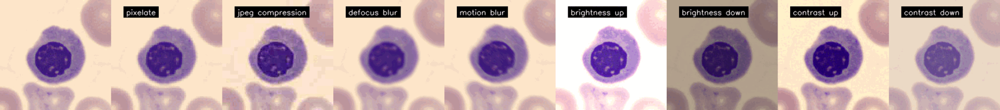

# 🏥 MedMNIST-C 

We introduce MedMNIST-C [[preprint](https://arxiv.org/pdf/2406.17536)], a `benchmark dataset` based on the MedMNIST+ collection covering `12 2D datasets and 9 imaging modalities`.  We simulate task and modality-specific image corruptions of varying severity to comprehensively evaluate the robustness of established algorithms against `real-world artifacts` and `distribution shifts`. We further show that our simple-to-use artificial corruptions allow for highly performant, lightweight `data augmentation` to enhance model robustness.

<p align="center">
   
</p>

> You can download the corrupted datasets from [Zenodo](https://zenodo.org/records/11471504). 
Due to space constraints, we have uploaded all datasets except for TissueMNIST-C. However, You can still reproduce it using our APIs.

## Installation and Requirements

```
pip install medmnistc
```

We do require [Wand](https://docs.wand-py.org/en/latest/guide/install.html) for image manipulation, a Python binding for [ImageMagick](https://imagemagick.org/index.php). Thus, if you are using Ubuntu:

```
sudo apt-get install libmagickwand-dev
```

otherwise, please check the [tutorial](https://docs.wand-py.org/en/0.2.4/guide/install.html).

## Main components

* `medmnistc/corruptions/registry.py`: List of all the corruptions and respective intensity hyperparameters.
* `medmnistc/dataset_manager.py`: Dataset class responsible for the creation of the corrupted datasets.
* `medmnistc/visualizer.py`: Class used to visualize and store the defined corruptions.
* `medmnistc/augmentation.py`: Augumentation class based on the defined corruptions.
* `medmnistc/dataset.py`: Dataset class used for the corrupted datasets.
* `medmnistc/eval.py`: PyTorch class used for model evaluation under corrupted datasets.
* `medmnistc/assets/baseline/*`: Normalization baselines used for model evaluation under corrupted datasets.

## Basic usage

### Create the corrupted datasets
```python
from medmnistc.dataset_manager import DatasetManager

medmnist_path = ... # PATH TO THE CLEAN IMAGES
medmnistc_path = ... # PATH TO THE CORRUPTED IMAGES

ds_manager = DatasetManager(medmnist_path = medmnist_path, output_path=output_path)
ds_manager.create_dataset(dataset_name = "breastmnist") # create a single corrupted test set
ds_manager.create_dataset(dataset_name = "all") # create all
```

### Augmentations
```python
from medmnistc.augmentation import AugMedMNISTC
from medmnistc.corruptions.registry import CORRUPTIONS_DS
import torchvision.transforms as transforms

dataset = "breastmnist" # select dataset
train_corruptions = CORRUPTIONS_DS[dataset] # load the designed corruptions for this dataset
images = ... # load images

# Augment with AugMedMNISTC
augment = AugMedMNISTC(train_corruptions)
augmented_img = augment(images[0])

# Integrate into transforms.Compose
aug_compose = transforms.Compose([
    AugMedMNISTC(train_corruptions),
    transforms.ToTensor(),
    transforms.Normalize(mean=..., std=...)
])

augmented_img = aug_compose(images[0])
```

### Notebooks

* [Create the dataset](assets/examples/create_dataset.ipynb)
* [Visualize the corruptions](assets/examples/visualize.ipynb)
* [Evaluate the corruptions](assets/examples/evaluation.ipynb)
* [Use the designed augmentations](assets/examples/augment.ipynb)

## Papers using MedMNIST-C

| **Authors**  | **Paper** | **Venue** | 
| ------------- | ------------- | ------------- |
| Manzari et al.  | Medical image classification with kan-integrated transformers and dilated neighborhood attention | [ArXiv'25](https://arxiv.org/abs/2502.13693) |
| Imam et al.  | On the Robustness of Medical Vision-Language Models: Are they Truly Generalizable? | [MIUA'25](https://arxiv.org/abs/2505.15425) | 
| Zeevi et al.  | Rate-In: Information-Driven Adaptive Dropout Rates for Improved Inference-Time Uncertainty Estimation | [CVPR'25](https://openaccess.thecvf.com/content/CVPR2025/papers/Zeevi_Rate-In_Information-Driven_Adaptive_Dropout_Rates_for_Improved_Inference-Time_Uncertainty_Estimation_CVPR_2025_paper.pdf) |
| Hekler et al.  | Beyond Overconfidence: Foundation Models Redefine Calibration in Deep Neural Networks | [ArXiv'25](https://www.arxiv.org/abs/2506.09593) |

## License

The code is under [Apache-2.0 License](./LICENSE).

The MedMNIST-C dataset is licensed under Creative Commons Attribution 4.0 International ([CC BY 4.0](https://creativecommons.org/licenses/by/4.0/)), except DermaMNIST-C under Creative Commons Attribution-NonCommercial 4.0 International ([CC BY-NC 4.0](https://creativecommons.org/licenses/by-nc/4.0/)).

## Citation

If you find this work useful, please consider citing us:
```
@misc{disalvo2024medmnistc,
      title={MedMNIST-C: Comprehensive benchmark and improved classifier robustness by simulating realistic image corruptions}, 
      author={Francesco Di Salvo and Sebastian Doerrich and Christian Ledig},
      year={2024},
      eprint={2406.17536},
      archivePrefix={arXiv},
      primaryClass={eess.IV},
      url={https://arxiv.org/abs/2406.17536}, 
}
```

`DISCLAIMER`: This repository is inspired by MedMNIST APIs and the ImageNet-C repository. Thus, please also consider citing [MedMNIST](https://www.nature.com/articles/s41597-022-01721-8), the respective source datasets (described [here](https://medmnist.com/)) and [ImageNet-C](https://arxiv.org/abs/1903.12261).  

## Release versions

* `v0.1.0`: MedMNIST-C beta release.
